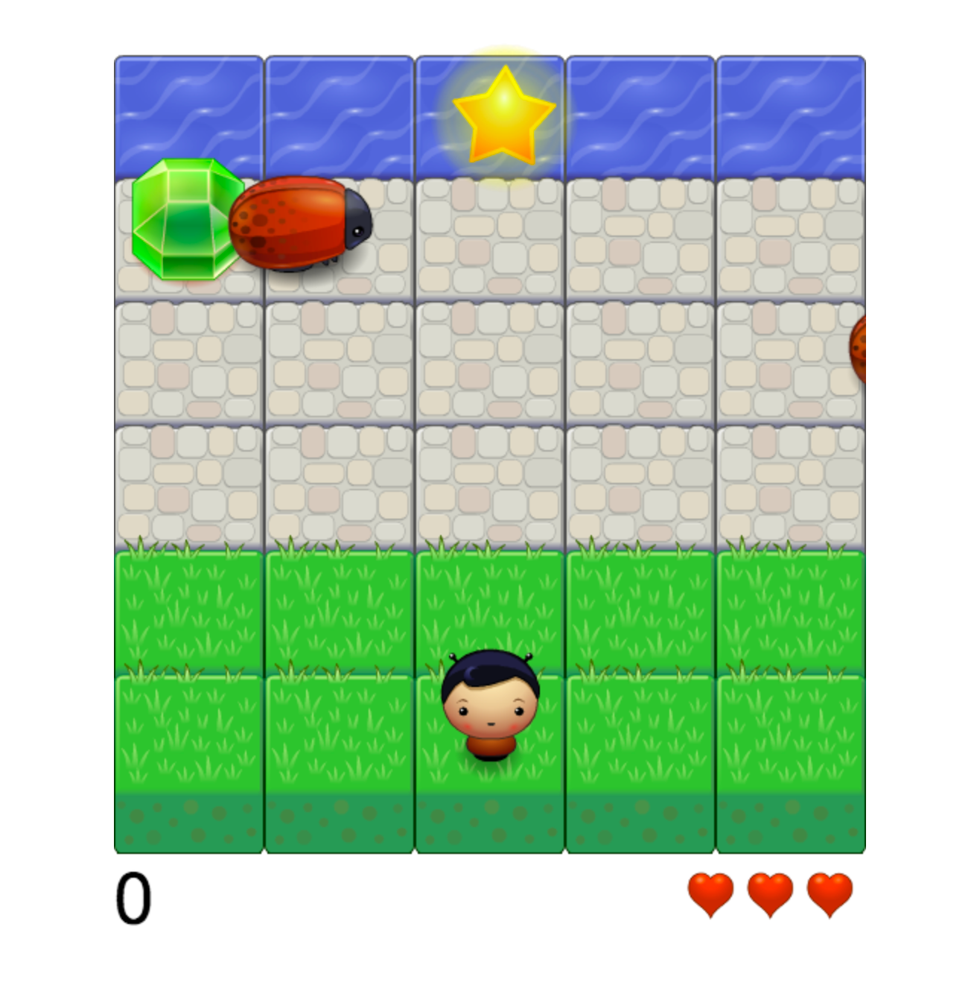

FROGGER Arcade Game
===============================

This simple arcade game was developed as a project from Udacity's Front End Nanodegree. All the assets and the game engine were provided by them. I wrote the game logic and objects, doing minor changes to the material provided.

### How to start the game:

	1. Go to pmrcunha.github.io/udacity_p3
	2. The game starts automatically
	3. When the game is over, you can restart it by pressing -Enter-

### How to play the game:

	1. Use the directional keys to move your character
	2. Your goal is to reach the water without colliding with the bugs
	3. When you reach the water you gain points and return to the start position
	4. When you hit a bug you lose one life and return to the start position
	5. The game is over when you have no lives left.
	6. You can collect bonuses to increase your score:
		6.1 If you finish in a "Star" block you get 1000 points extra
		6.2 You can also get gems in the bugs' path:
			* Green - the most common, 500 points
			* Blue  - less common, 2000 points
			* Orange - rare, 5000 points

Hope you enjoy the game!
